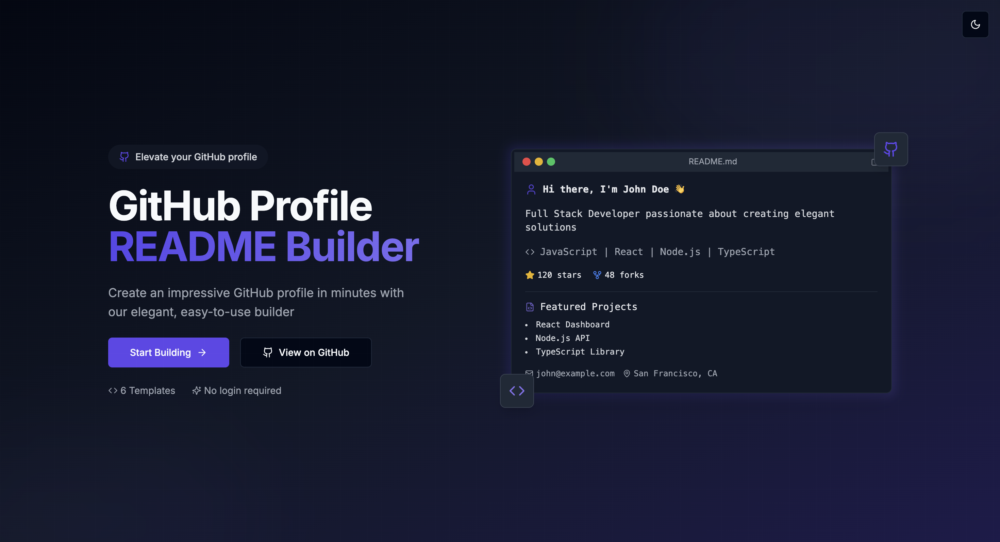

# GitHub Profile README Builder 🚀

Create beautiful, customizable GitHub profile READMEs with ease. No coding required!

## ✨ Features

- **Multiple Templates**: Choose from 6 professionally designed templates (Modern, Minimal, Creative, Developer, Professional, and Elegant)
- **Real-time Preview**: See your changes instantly with a live markdown preview
- **GitHub Integration**: Automatically fetch your GitHub stats, repositories, and contribution data
- **Customizable Sections**: Add/remove sections like skills, projects, experience, education, and more
- **Color Themes**: Personalize your profile with custom color schemes
- **GitHub Stats**: Display your GitHub statistics, top languages, and contribution streak
- **Contribution Graph**: Show your GitHub contribution activity with customizable themes
- **Achievement Trophies**: Showcase your GitHub achievements with customizable trophy displays
- **One-click Copy**: Copy the generated markdown with a single click
- **Dark Mode Support**: Switch between light and dark themes for comfortable editing
- **Responsive Design**: Works on desktop, tablet, and mobile devices

## 🚀 Getting Started

### Online Builder

The easiest way to use GitHub Profile Builder is through our online tool:

👉 [Open GitHub Profile Builder](https://dev-ashishk.github.io/github-profile-builder/)

### Local Development

To run the project locally:

\`\`\`bash
# Clone the repository
git clone https://github.com/dev-ashishk/github-profile-builder.git

# Navigate to the project directory
cd github-profile-builder

# Install dependencies
npm install

# Start the development server
npm run dev
\`\`\`

Open [http://localhost:3000](http://localhost:3000) in your browser to see the application.

## 📝 How to Use

1. **Enter Your Information**: Fill in your name, title, bio, and other details
2. **Connect GitHub**: Enter your GitHub username to automatically fetch your stats
3. **Customize Sections**: Add skills, projects, work experience, and more
4. **Choose a Template**: Select from 6 beautiful templates
5. **Personalize Colors**: Customize the color scheme to match your style
6. **Preview & Copy**: Preview your profile and copy the generated markdown
7. **Paste into GitHub**: Create a repository named after your GitHub username and paste the markdown into the README.md file

## 🛠️ Technologies Used

- [Next.js](https://nextjs.org/) - React framework
- [React](https://reactjs.org/) - UI library
- [Tailwind CSS](https://tailwindcss.com/) - Utility-first CSS framework
- [shadcn/ui](https://ui.shadcn.com/) - UI component library

## 🤝 Contributing

Contributions are welcome! Please feel free to submit a Pull Request.

1. Fork the repository
2. Create your feature branch (`git checkout -b feature/amazing-feature`)
3. Commit your changes (`git commit -m 'Add some amazing feature'`)
4. Push to the branch (`git push origin feature/amazing-feature`)
5. Open a Pull Request

## 📄 License

This project is licensed under the MIT License - see the [LICENSE](LICENSE) file for details.

## 🙏 Acknowledgements

- [GitHub README Stats](https://github.com/anuraghazra/github-readme-stats)
- [GitHub Streak Stats](https://github.com/DenverCoder1/github-readme-streak-stats)
- [GitHub Profile Trophy](https://github.com/ryo-ma/github-profile-trophy)
- [GitHub Contribution Chart Generator](https://github.com/sallar/github-contributions-chart)

---

Made with ❤️ by [dev-ashishk](https://github.com/dev-ashishk)

Keywords: GitHub profile, README generator, GitHub README, profile builder, GitHub stats, GitHub contribution graph, GitHub trophy, markdown generator, developer profile
