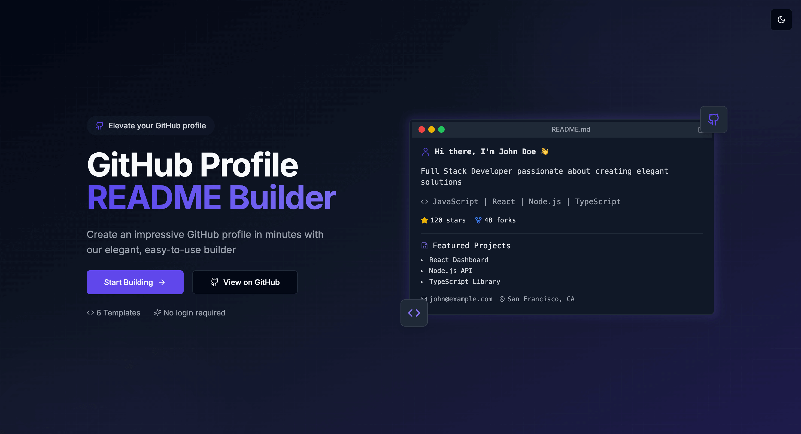

# 🚀 GitHub Profile README Builder

Craft a stunning GitHub profile in minutes—no coding needed!  
Our builder helps you design your profile README effortlessly with beautiful templates and powerful integrations.

---

## ✨ What You Get

- **6 Unique Templates** – Choose a look that suits your vibe: Modern, Minimal, Creative, Developer, Professional, or Elegant.
- **Live Preview** – Instantly see what your profile will look like while editing.
- **GitHub Integration** – Just enter your username, and we’ll pull in your stats, contributions, and top repos.
- **Fully Customizable Sections** – Add or remove sections like skills, projects, education, and work experience.
- **Color Customization** – Match your personal branding with color theme options.
- **GitHub Stats** – Automatically show off your GitHub metrics, top languages, and contribution streak.
- **Trophy Display** – Highlight your GitHub achievements with stylish trophy cards.
- **Contribution Graph** – Visualize your activity in style with themed graphs.
- **One-click Markdown Copy** – Grab your final README with a single click.
- **Dark Mode Friendly** – Switch between light and dark modes as you prefer.
- **Fully Responsive** – Works seamlessly on desktops, tablets, and phones.

---

## 🚀 Getting Started

### Use the Online Tool

No need to install anything—just head to the web app and start building:

👉 [Launch GitHub Profile Builder](https://dev-ashishk.github.io/github-profile-builder/)

### Want to Run It Locally?

If you’d like to clone and develop locally, here’s how:

\`\`\`bash
# Clone the repo
git clone https://github.com/dev-ashishk/github-profile-builder.git

# Go into the folder
cd github-profile-builder

# Install the dependencies
npm install

# Start the dev server
npm run dev
\`\`\`

Open your browser and go to [http://localhost:3000](http://localhost:3000)

---

## 📝 How It Works

1. Fill in your name, title, and bio.
2. Add your GitHub username—we'll fetch your stats automatically.
3. Customize sections like skills, work, education, and more.
4. Pick your favorite template.
5. Tweak the color theme to match your style.
6. Preview your README live.
7. Copy the markdown and paste it into your GitHub profile’s \`README.md\`.

---

## 🛠 Built With

- [Next.js](https://nextjs.org/) – React-powered web framework
- [React](https://reactjs.org/) – Frontend UI library
- [Tailwind CSS](https://tailwindcss.com/) – Utility-first styling
- [shadcn/ui](https://ui.shadcn.com/) – Modern UI components

---

## 🤝 Want to Contribute?

Awesome! Contributions are always welcome 🙌

1. Fork this repo
2. Create a branch (\`git checkout -b feature/cool-feature\`)
3. Commit your work (\`git commit -m 'Add cool feature'\`)
4. Push the branch (\`git push origin feature/cool-feature\`)
5. Open a Pull Request

---

## 📄 License

This project is open-sourced under the MIT License. See the [LICENSE](LICENSE) file for full details.

---

## 🙏 Special Thanks

Big thanks to these awesome projects:

- [GitHub README Stats](https://github.com/anuraghazra/github-readme-stats)
- [GitHub Streak Stats](https://github.com/DenverCoder1/github-readme-streak-stats)
- [GitHub Profile Trophy](https://github.com/ryo-ma/github-profile-trophy)
- [Contribution Chart Generator](https://github.com/sallar/github-contributions-chart)

---

Made with ❤️ by [dev-ashishk](https://github.com/dev-ashishk)